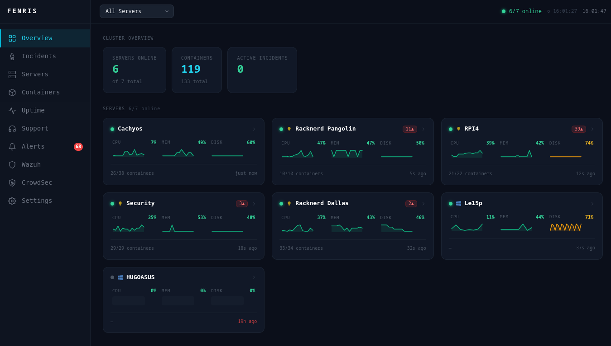

# Fenris

**Self-hosted infrastructure monitoring with AI-assisted alerting.**

Fenris collects system metrics, tracks Docker containers, correlates alerts into incidents, and optionally integrates with Wazuh (SIEM) and CrowdSec (threat intelligence). Everything runs in Docker Compose — no cloud account, no SaaS subscription.



---

## Features

### Infrastructure monitoring
- CPU, memory, disk, and network metrics every 30 seconds
- Multi-server: each agent registers itself; the dashboard shows all hosts in one view
- Linux agent (Node.js) and Windows agent (Go binary / PowerShell installer)
- Docker container monitoring — state, CPU %, memory, network I/O, per-container history charts, restart counts

### Intelligent alerting
- Z-score anomaly detection with per-server baselines (configurable window, min samples, threshold)
- Linear regression predictive alerts — warns before a threshold is crossed
- Container flapping detection — alerts when a container restarts ≥ 3 times in 15 minutes
- Image change detection — info alert when a container image hash changes
- Multi-channel dispatch: Discord, Slack, email (SMTP)

### Incident management
- Incidents group related alerts with severity, state (`new` / `investigating` / `resolved`), and assignment
- AI summary generation via OpenAI (optional) — summarises an incident's alert history in one call
- Notes and audit trail per incident

### Uptime monitoring
- HTTP/HTTPS endpoint monitors with configurable interval and expected status codes
- TLS certificate expiry tracking
- 24 h / 7 d / 30 d uptime percentages

### Security integrations
- **Wazuh** — polls your Wazuh manager API; imports agents and their alerts into Fenris
- **CrowdSec** — polls your CrowdSec LAPI; imports bans and decisions; shows top blocked scenarios and source countries

### Support tickets
- Lightweight IT helpdesk module — create, assign, and resolve tickets
- Time tracking per ticket (log minutes per note); totals roll up to reporting
- Stats page: by status, category, priority, technician, and requester

### Auth and access control
- Multi-user with roles: `admin`, `operator`, `viewer`
- JWT sessions (24 h); admin password shown once on first start
- Audit log for sensitive actions

---

## What Fenris does NOT do

- Replace a full observability stack (no distributed tracing, no log aggregation, no custom metrics pipeline)
- Run Wazuh or CrowdSec for you — Fenris reads from their APIs; you still deploy and manage them
- Send mobile push notifications (Discord/Slack cover this use case)
- Auto-remediate issues

---

## Architecture

```
┌─────────────────────┐        ┌──────────────────────┐
│   Linux Agent        │──────▶│                      │
│   (Node.js/TS)       │ POST  │   Fenris Server       │
├─────────────────────┤ /ingest│   (Fastify + Node.js) │
│   Windows Agent      │──────▶│   PostgreSQL 15       │
│   (Go binary)        │       │                      │
└─────────────────────┘        └──────────┬───────────┘
                                           │  REST API
                                           ▼
                                ┌──────────────────────┐
                                │   React Dashboard     │
                                │   (Vite + Recharts)   │
                                └──────────────────────┘
```

The server is the single source of truth. Agents push metrics; the dashboard polls via a REST API protected with JWT auth.

---

## Quick start

### Prerequisites
- Docker and Docker Compose v2
- Git

### 1. Clone and configure

```bash
git clone https://github.com/your-username/fenris.git
cd fenris

# Copy and fill in the environment file
cp .env.example .env
# Set POSTGRES_PASSWORD and FENRIS_API_KEY at minimum

# Copy and edit the server config
cp fenris.yaml.example fenris.yaml
# Configure alerts, integrations, etc. — see Configuration reference below
```

### 2. Start the stack

```bash
docker compose up -d
```

The dashboard is at **http://localhost:8081**

On first start the admin password is printed once to the server log:

```bash
docker compose logs server | grep -A 10 "FENRIS DEFAULT ADMIN"
```

See [FIRST_RUN.md](FIRST_RUN.md) for the full post-install checklist.

### 3. Install an agent on each host to monitor

**Linux (one-liner):**
```bash
curl -fsSL https://raw.githubusercontent.com/your-username/fenris/main/install.sh | bash
```
The installer prompts for your server URL and API key, then starts the agent as a container.

**Windows (PowerShell — run as Administrator):**
```powershell
Set-ExecutionPolicy Bypass -Scope Process -Force
iex (New-Object Net.WebClient).DownloadString('https://raw.githubusercontent.com/your-username/fenris/main/agent-windows/install.ps1')
```

> **Note:** Some AV products (including Bitdefender) flag the `iex (...DownloadString(...))` pattern. If blocked, download `install.ps1` manually and run it from disk.

After install the agent runs as a Windows Service (`FenrisAgent`):
```powershell
Start-Service FenrisAgent
Stop-Service FenrisAgent
Get-Service FenrisAgent
```
Config file: `C:\ProgramData\Fenris\fenris-agent.yaml`

### 4. Optional: built-in agent (monitor the host running the stack)

```bash
cp agent-local/fenris-agent.yaml.example agent-local/fenris-agent.yaml
# Edit agent-local/fenris-agent.yaml — set server_name and api_key
docker compose --profile agent up -d
```

---

## Configuration reference

### `.env`

| Variable | Required | Description |
|---|---|---|
| `POSTGRES_PASSWORD` | yes | PostgreSQL password |
| `FENRIS_API_KEY` | yes | Shared key agents use to authenticate |
| `JWT_SECRET` | recommended | 32+ char secret for JWT signing (auto-generated if omitted) |
| `VITE_API_KEY` | no | Embedded in web build; set to match `FENRIS_API_KEY` |
| `DOCKER_GID` | no | GID of the `docker` group on the host (default: 988) |

### `fenris.yaml` (server config)

See [`fenris.yaml.example`](fenris.yaml.example) for a fully annotated reference. Key sections:

```yaml
server:
  port: 3200
  api_key: "your-api-key"        # must match FENRIS_API_KEY in .env

alerts:
  discord_webhook: ""             # optional
  slack_webhook: ""               # optional
  email:
    enabled: false

anomaly_detection:
  enabled: true
  window_size: 100                # samples to keep per metric per server
  min_samples: 60                 # minimum before first alert fires
  z_score_threshold: 3.0

predictions:
  enabled: true
  lookahead_minutes: 30

ai:
  enabled: false
  openai_api_key: ""              # only needed for AI incident summaries
  model: "gpt-4o-mini"

wazuh:
  enabled: false
  url: "https://wazuh-manager:55000"
  username: "wazuh-wui"
  password: ""

crowdsec:
  - name: "my-server"
    url: "http://crowdsec:8080"
    api_key: ""

retention:
  metrics_days: 30
  alerts_days: 90
```

### `fenris-agent.yaml` (agent config)

```yaml
server_url: "http://your-fenris-server:3200"
api_key: "your-api-key"
server_name: "web-01"
collect_interval: "30s"
docker_enabled: true
collect_volume_sizes: false      # opt-in; slow on first run, results cached 5 min
disk_paths:
  - /
  - /mnt/data
```

---

## API reference

All endpoints require `Authorization: Bearer <jwt>` unless noted.

| Method | Path | Description |
|---|---|---|
| POST | `/api/v1/auth/login` | Get a JWT (public) |
| GET | `/api/v1/servers` | List servers |
| GET | `/api/v1/metrics` | Metrics (`?server_id=`, `?metric_type=`) |
| GET | `/api/v1/alerts` | Alerts (`?server_id=`, `?severity=`, `?acknowledged=`) |
| POST | `/api/v1/alerts/:id/acknowledge` | Acknowledge an alert |
| POST | `/api/v1/ingest` | Agent metric push (API key auth) |
| GET | `/api/v1/docker/containers` | Latest container snapshot |
| GET | `/api/v1/docker/containers/:server_id/:name/history` | Per-container history |
| GET | `/api/v1/docker/containers/:server_id/:name/restarts` | Restart counts (24 h / 7 d) |
| GET | `/api/v1/docker/events` | Container lifecycle events |
| GET | `/api/v1/docker/top` | Top consumers (`?metric=cpu\|memory\|network`) |
| GET | `/api/v1/monitors` | Uptime monitors |
| POST | `/api/v1/monitors` | Create monitor |
| GET | `/api/v1/incidents` | Incidents |
| POST | `/api/v1/incidents` | Create incident |
| GET | `/api/v1/support/tickets` | Support tickets |
| GET | `/api/v1/support/stats` | Support statistics |
| GET | `/api/v1/wazuh/status` | Wazuh integration status |
| GET | `/api/v1/crowdsec/status` | CrowdSec integration status |

---

## Integrations

### Wazuh

Fenris polls the Wazuh manager REST API and imports agent status and alerts. No Wazuh config changes needed — only read access required.

```yaml
# fenris.yaml
wazuh:
  enabled: true
  url: "https://your-wazuh-manager:55000"
  username: "wazuh-wui"
  password: "your-password"
  poll_interval_minutes: 5
```

### CrowdSec

Fenris polls the CrowdSec Local API and imports active decisions. Multiple LAPI instances are supported (one entry per instance).

```yaml
# fenris.yaml
crowdsec:
  - name: "prod"
    url: "http://crowdsec:8080"
    api_key: "your-bouncer-api-key"
    poll_interval_minutes: 5
```

---

## Roadmap

- [ ] Webhook inbound alerts (receive alerts from external tools)
- [ ] Grafana-compatible metrics export
- [ ] Agent auto-update mechanism
- [ ] LDAP / SSO authentication
- [ ] Mobile-optimised PWA

---

## Contributing

1. Fork and create a feature branch
2. `docker compose up -d` starts the full stack
3. Agent dev: `cd agent && npm install && npm run dev`
4. Server dev: `cd server && npm install && npm run dev`
5. Web dev: `cd web && npm install && npm run dev` (proxies `/api` to `localhost:3200`)
6. Open a pull request — describe what changed and why

---

## License

MIT — see [LICENSE](LICENSE)
